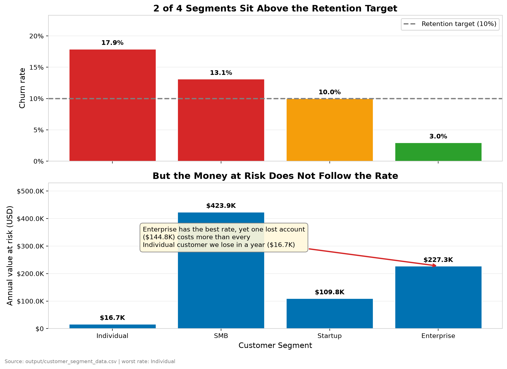
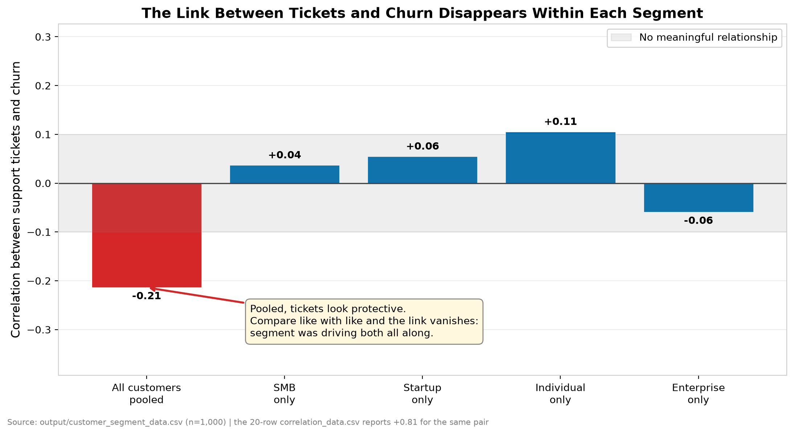
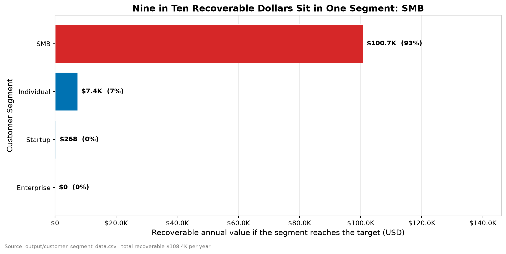

# Why Our Customers Leave

**A churn analysis for leadership.** Read time: about four minutes.
No charts or code required; the evidence is summarised in the appendix.

---

## The problem

We hold 1,000 customers worth $12,094,579 in lifetime value, and on current
rates churn takes $777,710 of that away every year. Leadership asked a direct
question: which customers are we losing, and what is the one change that would
keep the most of them? An earlier look at the data pointed at support contact.
That answer was wrong, and acting on it would have cost us money.

## What we examined

We looked at all 1,000 customers across four segments - Enterprise, SMB,
Startup and Individual. For each customer we had their segment, region, product
tier, lifetime value, support ticket count, how long they have stayed, and
whether they churned. We compared each of these against churn, first across the
whole customer base and then within each segment separately. We did not have
support response times; no system in this business records them today.

## What we found

- **2 of 4 segments sit above our 10% retention target.** Individual is worst
  at 17.9%, then SMB at 13.1%.
- **Support ticket volume does not drive churn.** Across the whole base,
  customers who file more tickets appear *less* likely to leave. Within any
  single segment that link disappears entirely.
- **How long someone has been a customer is the strongest signal we have.** The
  newest quarter of customers, under 6 months with us, churns at 15.6%, against
  10.7% for those past 19 months.
- **SMB holds 93% of the money we can actually recover** - $100,741 of
  $108,399, from 397 customers.
- **A good rate is not the same as low exposure.** Enterprise has our best rate
  at 3.0%, yet $227,292 is still at risk each year, because one account is
  worth $144,800 - more than every Individual customer we lose in a year put
  together ($16,732).

## Why this is happening

The support-ticket finding is a trap, and it is worth understanding before
anyone acts on it. Our Enterprise customers file the most tickets - about 12
each - and they also stay longest. Our Individual customers barely contact us
at all and leave fastest. Pool everyone together and it looks as though
contacting support keeps people loyal. It does not. Size does. Big accounts
have more people, more usage and more questions, and they also have contracts,
budgets and switching costs that keep them. Once we compare like with like -
SMB against SMB, Startup against Startup - the connection between tickets and
leaving vanishes to nothing. Ticket volume is a symptom of how large a customer
is, not a cause of whether they stay. A campaign to reduce support contact
would have suppressed the signal from our most valuable accounts while doing
nothing whatever about churn.

## What we recommend

- **Put retention effort into SMB, not everywhere.** SMB is 93% of the
  recoverable money. Bringing its 13.1% down to 10% returns $100,741 a year.
  Owner: Head of Customer Success. Target: within two quarters.
- **Protect Enterprise even though its rate looks healthy.** $227,292 sits at
  risk there, and a single lost account costs $144,800. Owner: Head of Sales.
  Target: a named account owner for all 53 accounts this quarter.
- **Concentrate on the first 6 months.** The newest quarter of customers churns
  at 15.6% against 10.7% for the most established. Owner: Head of Customer
  Success. Target: onboarding programme live next quarter.
- **Stop treating ticket volume as a churn warning, and start recording
  response times.** The signal we assumed was there is not. Owner: Head of
  Support. Target: response-time logging in place within one quarter.

---

## Evidence behind each finding

### Finding 1: three segments are above target

| Segment | Customers | Churn rate | Avg value | At risk / year | Recoverable |
|---|---|---|---|---|---|
| SMB | 397.0 | 13.1% | $8,140 | $423,906 | $100,741 |
| Individual | 197.0 | 17.9% | $474 | $16,732 | $7,389 |
| Startup | 353.0 | 10.0% | $3,102 | $109,780 | $268 |
| Enterprise | 53.0 | 3.0% | $144,800 | $227,292 | $0 |

*Recoverable* is the value returned if that segment reached the
10% target. It is zero where a segment is already at or below it.

**Why this evidence is convincing.** It covers every customer we have, not a
sample, and the gap between best and worst segment is
6 times - far
too large to be chance.

### Finding 2: support tickets do not drive churn

| Comparison | Link between tickets and churn | Reading |
|---|---|---|
| All 1,000 customers pooled | -0.21 | looks protective |
| SMB only | +0.04 | no meaningful link |
| Startup only | +0.06 | no meaningful link |
| Individual only | +0.11 | no meaningful link |
| Enterprise only | -0.06 | no meaningful link |

**Why this evidence is convincing.** The reversal is the proof. If ticket volume
genuinely kept customers, the link would hold inside each segment. It does not:
the strongest within-segment figure is 0.11, which is
nothing. The earlier analysis that pointed the other way used a
20-row file and reported +0.81. Twenty
rows cannot carry a decision of this size.

### Finding 3: the recoverable money is concentrated

SMB accounts for $100,741 of the
$108,399 available - 93% of it - from
397 customers.

**Why this evidence is convincing.** It reframes the priority. Individual
has the worst *rate*, but its customers are worth $474
each, so fixing it entirely returns
$7,389. Chasing the worst
percentage would have sent the team to the smallest prize.

---

## What we could not answer

**We have no support response times.** No file in this business records when a
ticket was answered, only how many were raised. The question "does answering
faster keep customers?" is a good one and we cannot currently answer it. That is
why recording response times is one of our four recommendations rather than a
finding.

**Churn has no history here.** We hold one churn figure per customer, not a
month-by-month series, so we can compare segments against each other and against
target, but not this quarter against last.

**These figures come from generated data.** This analysis runs on the project's
synthetic customer dataset. The method, the numbers and the reasoning are real;
the customers are not.

---

## Appendix: how these numbers were produced

| | |
|---|---|
| Dataset | `output/customer_segment_data.csv` (1,000 customers) |
| Analysis | `src/dashboard/narrative.py` |
| Charts | `src/dashboard/charts.py` |
| Rebuild | `python scripts/build_churn_narrative.py` |
| Retention target | 10%, the threshold `analyze_segments.py` already uses |
| Narrative length | 572 words |

Every figure quoted above is substituted from the analysis at build time. None
is typed by hand, so the prose cannot drift from the data.
