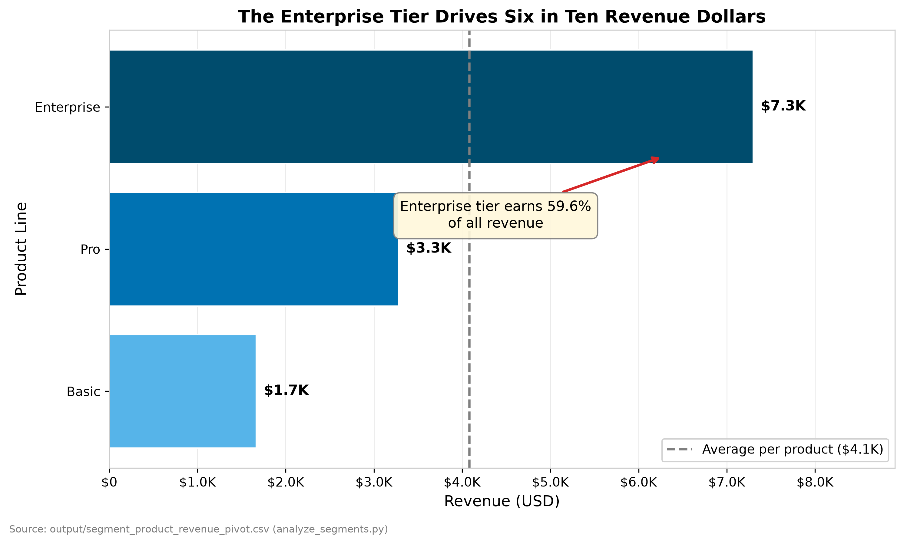
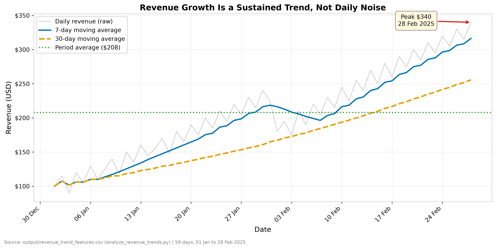
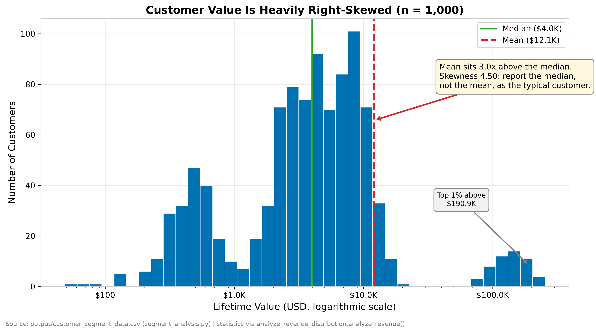
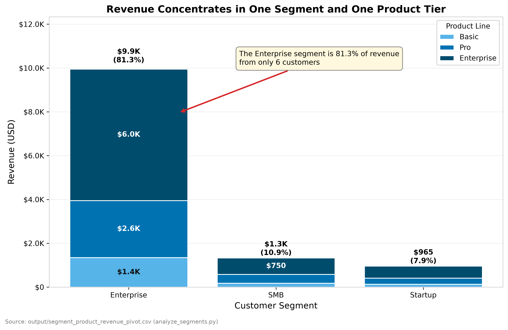
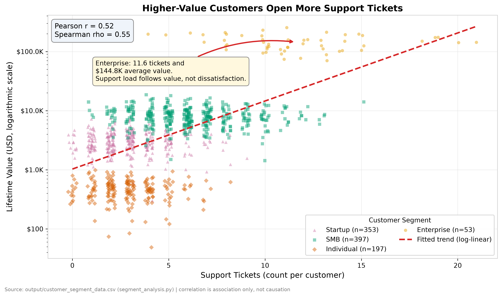

# Analysis Visualizations

Five charts covering the five core business data relationships. Every figure is
built by `src/dashboard/charts.py` and rendered by `python scripts/build_charts.py`
at 300 DPI. The Streamlit page **Business Overview** displays the same
builders, so these files and the dashboard cannot drift apart.

---

## Chart 1: Revenue by Product Line



- **Type:** Horizontal bar chart
- **Relationship:** Comparison across categories
- **Question:** Which product line generates the most revenue?
- **Data:** `output/segment_product_revenue_pivot.csv` (`analyze_segments.py`)
- **Key insight:** Enterprise generates $7.3K, or 59.6% of the $12.2K total.
- **Labels:** Title, x-axis "Revenue (USD)", y-axis "Product Line", currency data label on every bar, legend for the reference line.
- **Annotation:** Callout with arrow on the leading bar, plus a dashed vertical reference line at the average revenue per product so each bar reads as above or below par.
- **Why horizontal:** Product names are words, not quantities. Horizontal bars keep them readable without rotation.

## Chart 2: Daily Revenue Trend



- **Type:** Multi-series line chart
- **Relationship:** Trend over time
- **Question:** Is revenue genuinely growing, or is the daily movement noise?
- **Data:** `output/revenue_trend_features.csv` (`analyze_revenue_trends.py`)
- **Key insight:** The 30-day average rose 59.0% over the period, so the trend is up rather than random daily variation.
- **Labels:** Title, x-axis "Date" formatted as `05 Jan`, y-axis "Revenue (USD)", legend naming all four series.
- **Annotation:** Arrow marking the peak day, plus a dotted reference line at the period average.
- **Scope note:** The source covers **59 days** (01 Jan 2025 to 28 Feb 2025), not twelve months, and carries no product dimension. The three series are the raw values against their 7- and 30-day rolling averages. Titling this "12-month revenue by top 3 products" would describe data the project does not have.

## Chart 3: Customer Lifetime Value Distribution



- **Type:** Histogram, logarithmic value axis
- **Relationship:** Distribution of values
- **Question:** What is a typical customer worth, and how spread out is customer value?
- **Data:** `output/customer_segment_data.csv` (1,000 customers)
- **Key insight:** Values run from $49 to $253.7K with skewness 4.50. The mean of $12.1K sits 3.0x above the median of $4.0K, so the median is the honest headline figure.
- **Labels:** Title carrying the sample size, x-axis "Lifetime Value (USD, logarithmic scale)", y-axis "Number of Customers", legend for the median and mean lines.
- **Annotation:** Median and mean reference lines with a callout explaining why they differ, and a marker on the 99th percentile at $190.9K.
- **Why logarithmic:** The range spans more than 5,000x. On a linear axis every customer below $50,000 collapses into a single bar and the shape of the distribution disappears.
- **Statistics source:** computed by `analyze_revenue_distribution.analyze_revenue()`, the same function behind `output/revenue_distribution_analysis.json`, called here on the larger customer dataset.

## Chart 4: Revenue Composition by Segment and Product



- **Type:** Stacked bar chart
- **Relationship:** Composition and part-to-whole
- **Question:** How does each customer segment's revenue break down across product tiers?
- **Data:** `output/segment_product_revenue_pivot.csv` (`analyze_segments.py`)
- **Key insight:** The Enterprise segment contributes 81.3% of revenue, and within every segment the Enterprise product tier is the largest component.
- **Labels:** Title, x-axis "Customer Segment", y-axis "Revenue (USD)", legend titled "Product Line", currency labels inside each visible stack, segment total and share above each bar.
- **Annotation:** Callout tying the leading segment's revenue share to its customer count.
- **Segment count:** three products, within the five-segment readability limit.

## Chart 5: Support Tickets vs Customer Lifetime Value



- **Type:** Scatter plot with fitted trend line
- **Relationship:** Correlation between two variables
- **Question:** Do higher-value customers generate more support load?
- **Data:** `output/customer_segment_data.csv` (1,000 customers)
- **Key insight:** Pearson r = 0.52, Spearman rho = 0.55. Ticket volume rises with customer value, which reframes support cost as a consequence of account size rather than a symptom of dissatisfaction.
- **Labels:** Title, x-axis "Support Tickets (count per customer)", y-axis "Lifetime Value (USD, logarithmic scale)", legend titled "Customer Segment" with the sample size per segment, correlation coefficients in a fixed panel.
- **Annotation:** Callout on the Enterprise cluster naming its average tickets and average value.
- **Substitution note:** The brief asks for marketing spend against revenue. The repository holds no marketing spend column in any raw or processed file, so the strongest genuine relationship in the data was used instead. `data/raw/correlation_data.csv` was rejected as a source: its `engagement` and `transactions_per_month` columns correlate at exactly r = 1.000, a synthetic artefact that plots as a straight line.
- **Caution:** Correlation is association, not causation. This is the same caveat `analyze_correlations.py` records in `output/correlation_business_analysis.json`.

---

## Colour Palette

Two palettes are defined in `src/dashboard/theme.py`. Semantic colours carry a
fixed meaning and never rotate:

| Token | Hex | Role |
|---|---|---|
| `primary` | `#1f77b4` | Default single-series fill |
| `secondary` | `#ff7f0e` | Second series where a semantic accent is needed |
| `success` | `#2ca02c` | Targets, medians, and healthy thresholds |
| `danger` | `#d62728` | Alerts, means on skewed data, and annotation arrows |
| `neutral` | `#7f7f7f` | Reference lines, raw noise series, and source notes |

Categorical series use the Okabe-Ito colour-blind safe set:

`#0072B2`, `#E69F00`, `#009E73`, `#CC79A7`, `#56B4E9`, `#D55E00`

**Why two palettes.** The semantic set pairs `success` green with `danger` red.
That is safe for a lone reference line read against a label, but placing the two
adjacent as neighbouring series would be unreadable for the roughly 8% of men
with red-green colour vision deficiency. Categorical series therefore come from
Okabe-Ito, which is distinguishable under all common forms of colour blindness.

**Fixed assignments.** `Basic`, `Pro`, and `Enterprise` hold the same colour in
every chart, as do the customer segments. `Enterprise` is both a product line
and a customer segment in this dataset, so the two maps deliberately share no
colour, and every axis label and legend title names its dimension explicitly
("Product Line", "Customer Segment"). A viewer must never read the Enterprise
product and the Enterprise segment as the same thing.

**Encoding beyond colour.** Product tier is ordinal, so its three colours form
a light-to-dark sequential ramp: luminance alone separates Basic, Pro, and
Enterprise, which survives greyscale printing without needing hatching.
Customer segment is nominal, so it gets distinct hues plus a distinct marker
shape per segment. No chart relies on hue alone to carry meaning.

## Number Formatting

`theme.fmt_currency` scales its unit to the magnitude of the value: `$7.3K` for
product revenue, `$253.7K` for customer value, `$1.2M` above a million. A fixed
`value / 1e6` divisor cannot serve this project - product revenue peaks at
$7.3K, which would label every axis tick `$0.0M`.

## Regenerating

```
python scripts/build_charts.py
```

Requires the upstream artifacts in `output/`. If one is missing, the script
names the analysis script that produces it.
